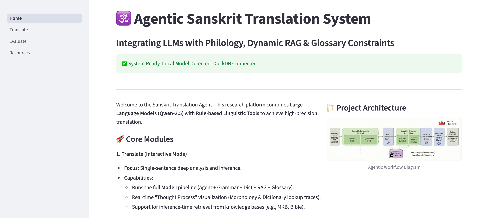

# Agentic Sanskrit–English Translation 

This repository contains the code for an **agentic, tool-augmented Sanskrit–English translation system** built on a frozen small language model (Qwen2.5-7B).  
The system improves translation quality **without any training or fine-tuning**, by orchestrating external linguistic tools at inference time.

The implementation accompanies an academic study on low-resource, morphologically rich language translation.

---

## Overview

The proposed system follows a **training-free, agentic translation paradigm**:

- **Figure 1** (Pipeline Overview) illustrates the overall architecture, showing how the language model, external tools, and data storage are connected.


- **Figure 2** (Stepwise Orchestration) details the sequential execution flow, from draft generation to evidence-based revision.


The agent adopts a *draft → evidence → revision* strategy inspired by human translation practice, enabling explicit linguistic grounding while preserving fluency.

---

## Tool Design

Each external linguistic resource is exposed to the agent as a **callable tool with a fixed input–output interface**:

- **Monier–Williams Dictionary**: provides lexical evidence at the lemma level  
- **Ambuda-DCS**: returns structured morphological and grammatical tags  
- **Glossary Constraints**: enforce standardized translations for predefined terms  
- **Dynamic Top-k Retrieval (optional)**: retrieves similar examples for domain and style conditioning, using a leakage-safe split  

All tool outputs and execution metadata are stored in **DuckDB** to support reproducibility and post-hoc analysis.

Our tool demonstration videos are available here:  
[](https://drive.google.com/drive/folders/1EcTHzdfSpEpe64GI08cjwHYctkv1QAOB?usp=sharing)


---

## Agent Orchestration

As summarized in **Figure 2**, given a Sanskrit input sentence, the agent:

1. Optionally retrieves glossary constraints and similar examples  
2. Generates an initial draft using a frozen Qwen2.5-7B model  
3. Invokes morphology (Ambuda) and dictionary (Monier–Williams) tools  
4. Compresses raw tool outputs into structured linguistic evidence  
5. Revises the draft under the retrieved evidence and constraints  

This process improves faithfulness and robustness without any parameter updates.

---

## Repository Structure

```text

.
├── Agentic_system/
│ Core implementation of the agentic translation framework, including
│ the orchestration logic, tool interfaces, prompt templates, and
│ DuckDB-based storage and logging.
│
├── gpt_eval/
│ Evaluation code for general-purpose GPT models, used as strong
│ off-the-shelf baselines for Sanskrit–English translation.
│
├── Sanskrit-specific_MT_eval/
│ Evaluation code for Sanskrit-specific machine translation systems,
│ including M2M100 and IndicTrans2.
│
├── Scripts/
│ Utility scripts for data preprocessing, analysis, and visualization
│ (e.g., glossary processing, result aggregation, plotting).
│
├── Dataset/
│ Linguistic resources and evaluation data, including:
│ - test sets for Sanskrit–English translation
│ - Monier–Williams Sanskrit–English dictionary data
│ - Ambuda-DCS morphological and grammatical resources
│ - curated glossary constraints
│
└── README.md
```

---

## Agentic Translation Pipeline

The system follows a **draft–evidence–revision** paradigm inspired by human translation practice:

1. Retrieve glossary constraints and similar examples  
2. Generate a draft translation with a frozen LLM  
3. Acquire linguistic evidence via dictionary and morphology tools  
4. Compress raw tool outputs into structured summaries  
5. Revise the draft using only the provided evidence and constraints  

This design allows the model to correct lexical and grammatical errors while preserving fluency.

---

## Evaluation Overview

### Internal Ablations
Multiple system configurations (A–I) evaluate the individual and combined effects of:
- Dictionary lookup
- Morphological analysis
- Dynamic retrieval
- Glossary constraints

### External Baselines
- **General-purpose LLMs**: GPT-based translation
- **Sanskrit-specific MT systems**: M2M100, IndicTrans2

Metrics:
- **chrF** (primary)
- **BLEU** (secondary, via SacreBLEU)

---

## Data and Resources

All linguistic resources are stored locally in a **DuckDB-backed infrastructure**.
They contain **no sentence-level translations from the evaluation sets**, ensuring no data leakage.

- Monier–Williams Dictionary: lexical definitions only
- Ambuda-DCS: structured morphological annotations
- Glossaries: curated domain-specific terminology

---

## Reproducibility Notes

- No model parameters are updated at any stage
- All tool calls and outputs are logged with run identifiers
- Retrieval is leakage-safe (sequential split or leave-one-out)
- Random seeds and decoding settings are fixed across experiments

---

## Model

The agent uses **Qwen2.5-7B-Instruct** as the base language model (frozen):
https://huggingface.co/Qwen/Qwen2.5-7B-Instruct

Model weights are **not included** in this repository and are loaded via Hugging Face.

---

## License and Usage

This repository is intended for **research and educational purposes**.
Please consult the original licenses of external models and linguistic resources before use.

---


